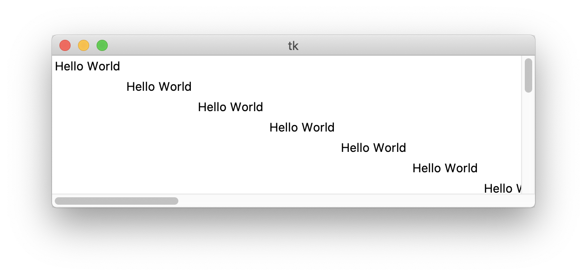

The scrollbars in Tkinter kind of suck..  Imagine a todo app that lists the todo items along with corresponding checkboxes in a vertical list.  When the list gets long, it might extend beyond the bottom of the window.  A scrollbar can solve that no problem, BUT, with Tkinter the scrollbars do not automatically include the new todo items in the scrollable area.  So all those super important action items are now out of reach!  Unfortunately, it's not straight forward to fix this issue with Tkinter and there are no examples online of how to get both vertical and horizontal scrolling working for a dynamic app.  It took me a few hours, but I developed a robust solution that will get your Tkinter todo list app, chess app, or whatever-else-your-heart-desires app scrolling properly in no time.

First create the window, containers for content, and scrollbars.  The only native scrollable container in Tkinter is a canvas, so add that to the window with a frame inside.  The frame is where widgets will go since widgets can't be added directly to a canvas.

```python
root = tk.Tk()

cTableContainer = tk.Canvas(root)
fTable = tk.Frame(cTableContainer)
sbHorizontalScrollBar = tk.Scrollbar(root)
sbVerticalScrollBar = tk.Scrollbar(root)
```

Now that we have the window setup, let's configure the scrollbars.  Attach the horizontal and vertical scrollbars to the canvas and position them at the bottom and right side of the screen where they belong.  Then bind the scroll events the the proper container.

```python
cTableContainer.config(xscrollcommand=sbHorizontalScrollBar.set,
        yscrollcommand=sbVerticalScrollBar.set, highlightthickness=0)
sbHorizontalScrollBar.config(orient=tk.HORIZONTAL, command=cTableContainer.xview)
sbVerticalScrollBar.config(orient=tk.VERTICAL, command=cTableContainer.yview)

sbHorizontalScrollBar.pack(fill=tk.X, side=tk.BOTTOM, expand=tk.FALSE)
sbVerticalScrollBar.pack(fill=tk.Y, side=tk.RIGHT, expand=tk.FALSE)
cTableContainer.pack(fill=tk.BOTH, side=tk.LEFT, expand=tk.TRUE)
cTableContainer.create_window(0, 0, window=fTable, anchor=tk.NW)
```

Finally, here is the magic function that updates the scrollable area.  Just call it when you add a new widget to the frame.  This took me well over any hour of reading the docs and forums to come up with.  I'll spare you the misery.

```python
def updateScrollRegion():
	cTableContainer.update_idletasks()
	cTableContainer.config(scrollregion=fTable.bbox())
```

Those are the building blocks you need to get your scrollbars working in a GUI with dynamically added widgets.  The gist below puts all the pieces together in an example app that shows both scrollbars updating the scrollable area while "hello world" labels are added across the screen.  Try it out yourself!



When you run the gist, you will see a window that looks like the one below with a new label being added every second.  The scrollbars will adjust when the new label is added so that you can scroll to them.



If you found [the above gist](https://gist.github.com/josephhutch/5fafbbe66db2e695a246fa99306b0420) helpful, give it a star so other developers in a scrolling crisis can find it :)